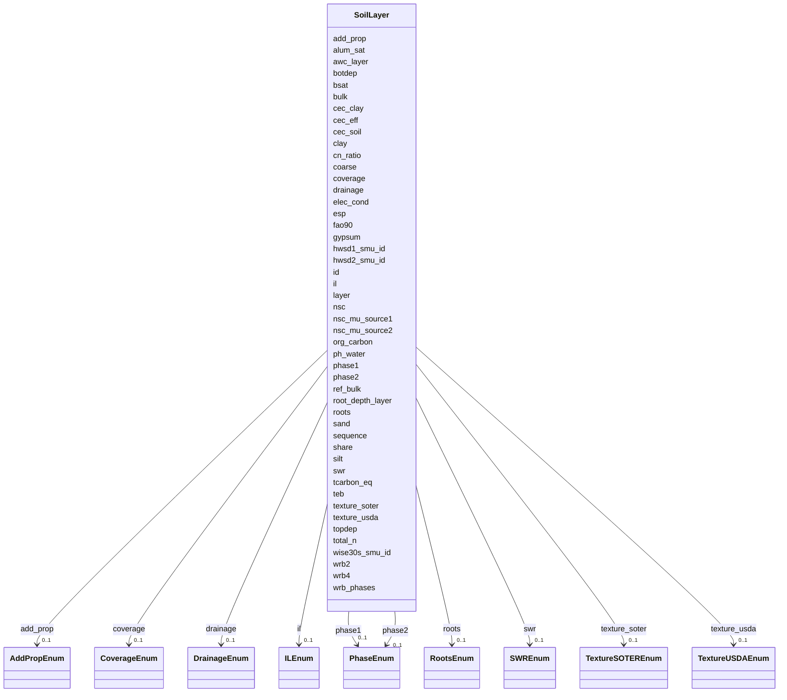

# Class: SoilLayer 


_Detailed soil properties at a specific depth layer. Each Soil Mapping Unit_

_can have multiple layers (typically D1 through D7) representing different_

_soil horizons from surface to depth._

__

_Contains comprehensive physical properties (texture, bulk density), chemical_

_properties (pH, organic carbon, nutrients), and cation exchange characteristics._


URI: [hwsd2:SoilLayer](https://w3id.org/bioepic-data/fao-soils/hwsd2/SoilLayer)





<!-- no inheritance hierarchy -->


## Slots

| Name | Cardinality and Range | Description | Inheritance |
| ---  | --- | --- | --- |
| [id](id.md) | 1 <br/> [Integer](Integer.md) | Database internal ID | direct |
| [hwsd2_smu_id](hwsd2_smu_id.md) | 1 <br/> [Integer](Integer.md) | Soil Mapping Unit identifier in HWSD version 2 | direct |
| [nsc_mu_source1](nsc_mu_source1.md) | 0..1 <br/> [String](String.md) | National Soil Classification source 1 | direct |
| [nsc_mu_source2](nsc_mu_source2.md) | 0..1 <br/> [String](String.md) | National Soil Classification source 2 | direct |
| [wise30s_smu_id](wise30s_smu_id.md) | 0..1 <br/> [String](String.md) | Soil Mapping Unit identifier from WISE30s database | direct |
| [hwsd1_smu_id](hwsd1_smu_id.md) | 0..1 <br/> [Integer](Integer.md) | Soil Mapping Unit identifier from HWSD version 1 | direct |
| [coverage](coverage.md) | 0..1 <br/> [CoverageEnum](CoverageEnum.md) | Data source coverage (ESDB, CHINA, SOTWIS, etc | direct |
| [sequence](sequence.md) | 0..1 <br/> [Integer](Integer.md) | Sequence number in Soil Mapping Unit | direct |
| [share](share.md) | 0..1 <br/> [Float](Float.md) | Percentage share in Soil Mapping Unit | direct |
| [nsc](nsc.md) | 0..1 <br/> [String](String.md) | National Soil Classification code | direct |
| [wrb_phases](wrb_phases.md) | 0..1 <br/> [String](String.md) | Detailed Soil Unit Symbol from WRB 2022 with phases | direct |
| [wrb4](wrb4.md) | 0..1 <br/> [String](String.md) | Soil Unit Symbol from World Reference Base 2022 (4-character code) | direct |
| [wrb2](wrb2.md) | 0..1 <br/> [String](String.md) | Soil Unit Symbol from WRB 2022 (2-character code) | direct |
| [fao90](fao90.md) | 0..1 <br/> [String](String.md) | Soil Unit Symbol from FAO 1990 classification | direct |
| [root_depth_layer](root_depth_layer.md) | 0..1 <br/> [String](String.md) | Rootable soil depth for specific layer | direct |
| [phase1](phase1.md) | 0..1 <br/> [PhaseEnum](PhaseEnum.md) | Primary soil phase (Stony, Lithic, Petric, etc | direct |
| [phase2](phase2.md) | 0..1 <br/> [PhaseEnum](PhaseEnum.md) | Secondary soil phase | direct |
| [roots](roots.md) | 0..1 <br/> [RootsEnum](RootsEnum.md) | Obstacle to roots depth in cm (ESDB) | direct |
| [il](il.md) | 0..1 <br/> [ILEnum](ILEnum.md) | Impermeable layer depth in cm (ESDB) | direct |
| [swr](swr.md) | 0..1 <br/> [SWREnum](SWREnum.md) | Soil Water Regime (ESDB) | direct |
| [drainage](drainage.md) | 0..1 <br/> [DrainageEnum](DrainageEnum.md) | Reference soil drainage class | direct |
| [awc_layer](awc_layer.md) | 0..1 <br/> [String](String.md) | Available Water Capacity for rootable soil depth | direct |
| [add_prop](add_prop.md) | 0..1 <br/> [AddPropEnum](AddPropEnum.md) | Additional soil properties (Gelic, Vertic) | direct |
| [layer](layer.md) | 0..1 <br/> [String](String.md) | Depth layer code (D1 through D7) | direct |
| [topdep](topdep.md) | 0..1 <br/> [Integer](Integer.md) | Depth of top of layer | direct |
| [botdep](botdep.md) | 0..1 <br/> [Integer](Integer.md) | Depth of bottom of layer | direct |
| [coarse](coarse.md) | 0..1 <br/> [Float](Float.md) | Coarse fragments percentage by volume | direct |
| [sand](sand.md) | 0..1 <br/> [Float](Float.md) | Sand content percentage by weight | direct |
| [silt](silt.md) | 0..1 <br/> [Float](Float.md) | Silt content percentage by weight | direct |
| [clay](clay.md) | 0..1 <br/> [Float](Float.md) | Clay content percentage by weight | direct |
| [texture_usda](texture_usda.md) | 0..1 <br/> [TextureUSDAEnum](TextureUSDAEnum.md) | USDA soil texture class | direct |
| [texture_soter](texture_soter.md) | 0..1 <br/> [TextureSOTEREnum](TextureSOTEREnum.md) | SOTER soil texture class | direct |
| [bulk](bulk.md) | 0..1 <br/> [Float](Float.md) | Bulk density | direct |
| [ref_bulk](ref_bulk.md) | 0..1 <br/> [Float](Float.md) | Reference bulk density | direct |
| [org_carbon](org_carbon.md) | 0..1 <br/> [Float](Float.md) | Organic carbon content percentage by weight | direct |
| [ph_water](ph_water.md) | 0..1 <br/> [Float](Float.md) | pH measured in water | direct |
| [total_n](total_n.md) | 0..1 <br/> [Float](Float.md) | Total nitrogen content | direct |
| [cn_ratio](cn_ratio.md) | 0..1 <br/> [Float](Float.md) | Carbon to nitrogen ratio (C/N) | direct |
| [cec_soil](cec_soil.md) | 0..1 <br/> [Float](Float.md) | Cation Exchange Capacity of soil | direct |
| [cec_clay](cec_clay.md) | 0..1 <br/> [Float](Float.md) | Cation Exchange Capacity of clay fraction | direct |
| [cec_eff](cec_eff.md) | 0..1 <br/> [Float](Float.md) | Effective Cation Exchange Capacity (ECEC) | direct |
| [teb](teb.md) | 0..1 <br/> [Float](Float.md) | Total Exchangeable Bases | direct |
| [bsat](bsat.md) | 0..1 <br/> [Float](Float.md) | Base saturation percentage | direct |
| [alum_sat](alum_sat.md) | 0..1 <br/> [Float](Float.md) | Aluminium saturation percentage | direct |
| [esp](esp.md) | 0..1 <br/> [Float](Float.md) | Exchangeable Sodium Percentage | direct |
| [tcarbon_eq](tcarbon_eq.md) | 0..1 <br/> [Float](Float.md) | Calcium carbonate equivalent percentage by weight | direct |
| [gypsum](gypsum.md) | 0..1 <br/> [Float](Float.md) | Gypsum content percentage by weight | direct |
| [elec_cond](elec_cond.md) | 0..1 <br/> [Float](Float.md) | Electric conductivity | direct |


## Identifier and Mapping Information


### Schema Source


* from schema: https://w3id.org/bioepic-data/fao-soils/hwsd2


## Mappings

| Mapping Type | Mapped Value |
| ---  | ---  |
| self | hwsd2:SoilLayer |
| native | hwsd2:SoilLayer |


## LinkML Source

<!-- TODO: investigate https://stackoverflow.com/questions/37606292/how-to-create-tabbed-code-blocks-in-mkdocs-or-sphinx -->

### Direct

<details>
```yaml
name: SoilLayer
description: 'Detailed soil properties at a specific depth layer. Each Soil Mapping
  Unit

  can have multiple layers (typically D1 through D7) representing different

  soil horizons from surface to depth.


  Contains comprehensive physical properties (texture, bulk density), chemical

  properties (pH, organic carbon, nutrients), and cation exchange characteristics.'
from_schema: https://w3id.org/bioepic-data/fao-soils/hwsd2
slots:
- id
- hwsd2_smu_id
- nsc_mu_source1
- nsc_mu_source2
- wise30s_smu_id
- hwsd1_smu_id
- coverage
- sequence
- share
- nsc
- wrb_phases
- wrb4
- wrb2
- fao90
- root_depth_layer
- phase1
- phase2
- roots
- il
- swr
- drainage
- awc_layer
- add_prop
- layer
- topdep
- botdep
- coarse
- sand
- silt
- clay
- texture_usda
- texture_soter
- bulk
- ref_bulk
- org_carbon
- ph_water
- total_n
- cn_ratio
- cec_soil
- cec_clay
- cec_eff
- teb
- bsat
- alum_sat
- esp
- tcarbon_eq
- gypsum
- elec_cond
class_uri: hwsd2:SoilLayer

```
</details>

### Induced

<details>
```yaml
name: SoilLayer
description: 'Detailed soil properties at a specific depth layer. Each Soil Mapping
  Unit

  can have multiple layers (typically D1 through D7) representing different

  soil horizons from surface to depth.


  Contains comprehensive physical properties (texture, bulk density), chemical

  properties (pH, organic carbon, nutrients), and cation exchange characteristics.'
from_schema: https://w3id.org/bioepic-data/fao-soils/hwsd2
attributes:
  id:
    name: id
    description: Database internal ID
    from_schema: https://w3id.org/bioepic-data/fao-soils/hwsd2
    rank: 1000
    identifier: true
    alias: id
    owner: SoilLayer
    domain_of:
    - SoilMappingUnit
    - SoilLayer
    - WRBClass
    range: integer
    required: true
  hwsd2_smu_id:
    name: hwsd2_smu_id
    description: Soil Mapping Unit identifier in HWSD version 2
    from_schema: https://w3id.org/bioepic-data/fao-soils/hwsd2
    rank: 1000
    alias: hwsd2_smu_id
    owner: SoilLayer
    domain_of:
    - SoilMappingUnit
    - SoilLayer
    range: integer
    required: true
  nsc_mu_source1:
    name: nsc_mu_source1
    description: National Soil Classification source 1
    from_schema: https://w3id.org/bioepic-data/fao-soils/hwsd2
    rank: 1000
    alias: nsc_mu_source1
    owner: SoilLayer
    domain_of:
    - SoilLayer
    range: string
  nsc_mu_source2:
    name: nsc_mu_source2
    description: National Soil Classification source 2
    from_schema: https://w3id.org/bioepic-data/fao-soils/hwsd2
    rank: 1000
    alias: nsc_mu_source2
    owner: SoilLayer
    domain_of:
    - SoilLayer
    range: string
  wise30s_smu_id:
    name: wise30s_smu_id
    description: Soil Mapping Unit identifier from WISE30s database
    from_schema: https://w3id.org/bioepic-data/fao-soils/hwsd2
    rank: 1000
    alias: wise30s_smu_id
    owner: SoilLayer
    domain_of:
    - SoilMappingUnit
    - SoilLayer
    range: string
  hwsd1_smu_id:
    name: hwsd1_smu_id
    description: Soil Mapping Unit identifier from HWSD version 1
    from_schema: https://w3id.org/bioepic-data/fao-soils/hwsd2
    rank: 1000
    alias: hwsd1_smu_id
    owner: SoilLayer
    domain_of:
    - SoilMappingUnit
    - SoilLayer
    range: integer
  coverage:
    name: coverage
    description: Data source coverage (ESDB, CHINA, SOTWIS, etc.)
    from_schema: https://w3id.org/bioepic-data/fao-soils/hwsd2
    rank: 1000
    alias: coverage
    owner: SoilLayer
    domain_of:
    - SoilMappingUnit
    - SoilLayer
    range: CoverageEnum
  sequence:
    name: sequence
    description: Sequence number in Soil Mapping Unit
    from_schema: https://w3id.org/bioepic-data/fao-soils/hwsd2
    rank: 1000
    alias: sequence
    owner: SoilLayer
    domain_of:
    - SoilLayer
    range: integer
  share:
    name: share
    description: Percentage share in Soil Mapping Unit
    from_schema: https://w3id.org/bioepic-data/fao-soils/hwsd2
    rank: 1000
    alias: share
    owner: SoilLayer
    domain_of:
    - SoilMappingUnit
    - SoilLayer
    range: float
    minimum_value: 0
    maximum_value: 100
    unit:
      ucum_code: '%'
  nsc:
    name: nsc
    description: National Soil Classification code
    from_schema: https://w3id.org/bioepic-data/fao-soils/hwsd2
    rank: 1000
    alias: nsc
    owner: SoilLayer
    domain_of:
    - SoilLayer
    range: string
  wrb_phases:
    name: wrb_phases
    description: Detailed Soil Unit Symbol from WRB 2022 with phases
    from_schema: https://w3id.org/bioepic-data/fao-soils/hwsd2
    rank: 1000
    alias: wrb_phases
    owner: SoilLayer
    domain_of:
    - SoilMappingUnit
    - SoilLayer
    range: string
  wrb4:
    name: wrb4
    description: Soil Unit Symbol from World Reference Base 2022 (4-character code)
    from_schema: https://w3id.org/bioepic-data/fao-soils/hwsd2
    rank: 1000
    alias: wrb4
    owner: SoilLayer
    domain_of:
    - SoilMappingUnit
    - SoilLayer
    range: string
  wrb2:
    name: wrb2
    description: Soil Unit Symbol from WRB 2022 (2-character code)
    from_schema: https://w3id.org/bioepic-data/fao-soils/hwsd2
    rank: 1000
    alias: wrb2
    owner: SoilLayer
    domain_of:
    - SoilMappingUnit
    - SoilLayer
    range: string
  fao90:
    name: fao90
    description: Soil Unit Symbol from FAO 1990 classification
    from_schema: https://w3id.org/bioepic-data/fao-soils/hwsd2
    rank: 1000
    alias: fao90
    owner: SoilLayer
    domain_of:
    - SoilMappingUnit
    - SoilLayer
    range: string
  root_depth_layer:
    name: root_depth_layer
    description: Rootable soil depth for specific layer
    from_schema: https://w3id.org/bioepic-data/fao-soils/hwsd2
    rank: 1000
    alias: root_depth_layer
    owner: SoilLayer
    domain_of:
    - SoilLayer
    range: string
  phase1:
    name: phase1
    description: Primary soil phase (Stony, Lithic, Petric, etc.)
    from_schema: https://w3id.org/bioepic-data/fao-soils/hwsd2
    rank: 1000
    alias: phase1
    owner: SoilLayer
    domain_of:
    - SoilMappingUnit
    - SoilLayer
    range: PhaseEnum
  phase2:
    name: phase2
    description: Secondary soil phase
    from_schema: https://w3id.org/bioepic-data/fao-soils/hwsd2
    rank: 1000
    alias: phase2
    owner: SoilLayer
    domain_of:
    - SoilMappingUnit
    - SoilLayer
    range: PhaseEnum
  roots:
    name: roots
    description: Obstacle to roots depth in cm (ESDB)
    from_schema: https://w3id.org/bioepic-data/fao-soils/hwsd2
    rank: 1000
    alias: roots
    owner: SoilLayer
    domain_of:
    - SoilMappingUnit
    - SoilLayer
    range: RootsEnum
  il:
    name: il
    description: Impermeable layer depth in cm (ESDB)
    from_schema: https://w3id.org/bioepic-data/fao-soils/hwsd2
    rank: 1000
    alias: il
    owner: SoilLayer
    domain_of:
    - SoilMappingUnit
    - SoilLayer
    range: ILEnum
  swr:
    name: swr
    description: Soil Water Regime (ESDB)
    from_schema: https://w3id.org/bioepic-data/fao-soils/hwsd2
    rank: 1000
    alias: swr
    owner: SoilLayer
    domain_of:
    - SoilLayer
    range: SWREnum
  drainage:
    name: drainage
    description: Reference soil drainage class
    from_schema: https://w3id.org/bioepic-data/fao-soils/hwsd2
    rank: 1000
    alias: drainage
    owner: SoilLayer
    domain_of:
    - SoilMappingUnit
    - SoilLayer
    range: DrainageEnum
  awc_layer:
    name: awc_layer
    description: Available Water Capacity for rootable soil depth
    from_schema: https://w3id.org/bioepic-data/fao-soils/hwsd2
    rank: 1000
    alias: awc_layer
    owner: SoilLayer
    domain_of:
    - SoilLayer
    range: string
    unit:
      ucum_code: mm
  add_prop:
    name: add_prop
    description: Additional soil properties (Gelic, Vertic)
    from_schema: https://w3id.org/bioepic-data/fao-soils/hwsd2
    rank: 1000
    alias: add_prop
    owner: SoilLayer
    domain_of:
    - SoilMappingUnit
    - SoilLayer
    range: AddPropEnum
  layer:
    name: layer
    description: Depth layer code (D1 through D7)
    from_schema: https://w3id.org/bioepic-data/fao-soils/hwsd2
    rank: 1000
    alias: layer
    owner: SoilLayer
    domain_of:
    - SoilLayer
    range: string
    pattern: ^D[1-7]$
  topdep:
    name: topdep
    description: Depth of top of layer
    from_schema: https://w3id.org/bioepic-data/fao-soils/hwsd2
    rank: 1000
    alias: topdep
    owner: SoilLayer
    domain_of:
    - SoilLayer
    range: integer
    minimum_value: 0
    unit:
      ucum_code: cm
  botdep:
    name: botdep
    description: Depth of bottom of layer
    from_schema: https://w3id.org/bioepic-data/fao-soils/hwsd2
    rank: 1000
    alias: botdep
    owner: SoilLayer
    domain_of:
    - SoilLayer
    range: integer
    minimum_value: 0
    unit:
      ucum_code: cm
  coarse:
    name: coarse
    description: Coarse fragments percentage by volume
    from_schema: https://w3id.org/bioepic-data/fao-soils/hwsd2
    rank: 1000
    alias: coarse
    owner: SoilLayer
    domain_of:
    - SoilLayer
    range: float
    minimum_value: 0
    maximum_value: 100
    unit:
      ucum_code: '% volume'
  sand:
    name: sand
    description: Sand content percentage by weight
    from_schema: https://w3id.org/bioepic-data/fao-soils/hwsd2
    rank: 1000
    alias: sand
    owner: SoilLayer
    domain_of:
    - SoilLayer
    range: float
    minimum_value: 0
    maximum_value: 100
    unit:
      ucum_code: '% weight'
  silt:
    name: silt
    description: Silt content percentage by weight
    from_schema: https://w3id.org/bioepic-data/fao-soils/hwsd2
    rank: 1000
    alias: silt
    owner: SoilLayer
    domain_of:
    - SoilLayer
    range: float
    minimum_value: 0
    maximum_value: 100
    unit:
      ucum_code: '% weight'
  clay:
    name: clay
    description: Clay content percentage by weight
    from_schema: https://w3id.org/bioepic-data/fao-soils/hwsd2
    rank: 1000
    alias: clay
    owner: SoilLayer
    domain_of:
    - SoilLayer
    range: float
    minimum_value: 0
    maximum_value: 100
    unit:
      ucum_code: '% weight'
  texture_usda:
    name: texture_usda
    description: USDA soil texture class
    from_schema: https://w3id.org/bioepic-data/fao-soils/hwsd2
    rank: 1000
    alias: texture_usda
    owner: SoilLayer
    domain_of:
    - SoilMappingUnit
    - SoilLayer
    range: TextureUSDAEnum
  texture_soter:
    name: texture_soter
    description: SOTER soil texture class
    from_schema: https://w3id.org/bioepic-data/fao-soils/hwsd2
    rank: 1000
    alias: texture_soter
    owner: SoilLayer
    domain_of:
    - SoilLayer
    range: TextureSOTEREnum
  bulk:
    name: bulk
    description: Bulk density
    from_schema: https://w3id.org/bioepic-data/fao-soils/hwsd2
    rank: 1000
    alias: bulk
    owner: SoilLayer
    domain_of:
    - SoilLayer
    range: float
    minimum_value: 0
    maximum_value: 3
    unit:
      ucum_code: g/cm3
  ref_bulk:
    name: ref_bulk
    description: Reference bulk density
    from_schema: https://w3id.org/bioepic-data/fao-soils/hwsd2
    rank: 1000
    alias: ref_bulk
    owner: SoilLayer
    domain_of:
    - SoilLayer
    range: float
    minimum_value: 0
    maximum_value: 3
    unit:
      ucum_code: g/cm3
  org_carbon:
    name: org_carbon
    description: Organic carbon content percentage by weight
    from_schema: https://w3id.org/bioepic-data/fao-soils/hwsd2
    rank: 1000
    alias: org_carbon
    owner: SoilLayer
    domain_of:
    - SoilLayer
    range: float
    minimum_value: 0
    maximum_value: 100
    unit:
      ucum_code: '% weight'
  ph_water:
    name: ph_water
    description: pH measured in water
    from_schema: https://w3id.org/bioepic-data/fao-soils/hwsd2
    rank: 1000
    alias: ph_water
    owner: SoilLayer
    domain_of:
    - SoilLayer
    range: float
    minimum_value: 0
    maximum_value: 14
    unit:
      ucum_code: -log(H+)
  total_n:
    name: total_n
    description: Total nitrogen content
    from_schema: https://w3id.org/bioepic-data/fao-soils/hwsd2
    rank: 1000
    alias: total_n
    owner: SoilLayer
    domain_of:
    - SoilLayer
    range: float
    minimum_value: 0
    unit:
      ucum_code: g/kg
  cn_ratio:
    name: cn_ratio
    description: Carbon to nitrogen ratio (C/N)
    from_schema: https://w3id.org/bioepic-data/fao-soils/hwsd2
    rank: 1000
    alias: cn_ratio
    owner: SoilLayer
    domain_of:
    - SoilLayer
    range: float
    minimum_value: 0
  cec_soil:
    name: cec_soil
    description: Cation Exchange Capacity of soil
    from_schema: https://w3id.org/bioepic-data/fao-soils/hwsd2
    rank: 1000
    alias: cec_soil
    owner: SoilLayer
    domain_of:
    - SoilLayer
    range: float
    minimum_value: 0
    unit:
      ucum_code: cmolc/kg
  cec_clay:
    name: cec_clay
    description: Cation Exchange Capacity of clay fraction
    from_schema: https://w3id.org/bioepic-data/fao-soils/hwsd2
    rank: 1000
    alias: cec_clay
    owner: SoilLayer
    domain_of:
    - SoilLayer
    range: float
    minimum_value: 0
    unit:
      ucum_code: cmolc/kg
  cec_eff:
    name: cec_eff
    description: Effective Cation Exchange Capacity (ECEC)
    from_schema: https://w3id.org/bioepic-data/fao-soils/hwsd2
    rank: 1000
    alias: cec_eff
    owner: SoilLayer
    domain_of:
    - SoilLayer
    range: float
    minimum_value: 0
    unit:
      ucum_code: cmolc/kg
  teb:
    name: teb
    description: Total Exchangeable Bases
    from_schema: https://w3id.org/bioepic-data/fao-soils/hwsd2
    rank: 1000
    alias: teb
    owner: SoilLayer
    domain_of:
    - SoilLayer
    range: float
    minimum_value: 0
    unit:
      ucum_code: cmolc/kg
  bsat:
    name: bsat
    description: Base saturation percentage
    from_schema: https://w3id.org/bioepic-data/fao-soils/hwsd2
    rank: 1000
    alias: bsat
    owner: SoilLayer
    domain_of:
    - SoilLayer
    range: float
    minimum_value: 0
    maximum_value: 100
    unit:
      ucum_code: '% CECsoil'
  alum_sat:
    name: alum_sat
    description: Aluminium saturation percentage
    from_schema: https://w3id.org/bioepic-data/fao-soils/hwsd2
    rank: 1000
    alias: alum_sat
    owner: SoilLayer
    domain_of:
    - SoilLayer
    range: float
    minimum_value: 0
    maximum_value: 100
    unit:
      ucum_code: '% ECEC'
  esp:
    name: esp
    description: Exchangeable Sodium Percentage
    from_schema: https://w3id.org/bioepic-data/fao-soils/hwsd2
    rank: 1000
    alias: esp
    owner: SoilLayer
    domain_of:
    - SoilLayer
    range: float
    minimum_value: 0
    maximum_value: 100
    unit:
      ucum_code: '%'
  tcarbon_eq:
    name: tcarbon_eq
    description: Calcium carbonate equivalent percentage by weight
    from_schema: https://w3id.org/bioepic-data/fao-soils/hwsd2
    rank: 1000
    alias: tcarbon_eq
    owner: SoilLayer
    domain_of:
    - SoilLayer
    range: float
    minimum_value: 0
    maximum_value: 100
    unit:
      ucum_code: '% weight'
  gypsum:
    name: gypsum
    description: Gypsum content percentage by weight
    from_schema: https://w3id.org/bioepic-data/fao-soils/hwsd2
    rank: 1000
    alias: gypsum
    owner: SoilLayer
    domain_of:
    - SoilLayer
    range: float
    minimum_value: 0
    maximum_value: 100
    unit:
      ucum_code: '% weight'
  elec_cond:
    name: elec_cond
    description: Electric conductivity
    from_schema: https://w3id.org/bioepic-data/fao-soils/hwsd2
    rank: 1000
    alias: elec_cond
    owner: SoilLayer
    domain_of:
    - SoilLayer
    range: float
    minimum_value: 0
    unit:
      ucum_code: dS/m
class_uri: hwsd2:SoilLayer

```
</details>