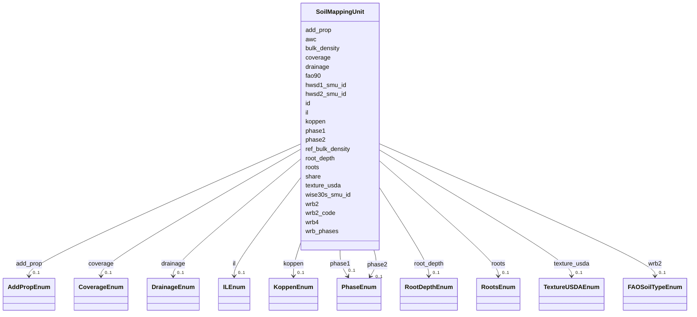

# Class: SoilMappingUnit 


_A Soil Mapping Unit (SMU) represents a distinct area with relatively homogeneous_

_soil characteristics. Each SMU may contain multiple soil types with their_

_proportional shares._


URI: [hwsd2:SoilMappingUnit](https://w3id.org/bioepic-data/fao-soils/hwsd2/SoilMappingUnit)





<!-- no inheritance hierarchy -->


## Slots

| Name | Cardinality and Range | Description | Inheritance |
| ---  | --- | --- | --- |
| [id](id.md) | 1 <br/> [Integer](Integer.md) | Database internal ID | direct |
| [hwsd2_smu_id](hwsd2_smu_id.md) | 1 <br/> [Integer](Integer.md) | Soil Mapping Unit identifier in HWSD version 2 | direct |
| [wise30s_smu_id](wise30s_smu_id.md) | 0..1 <br/> [String](String.md) | Soil Mapping Unit identifier from WISE30s database | direct |
| [hwsd1_smu_id](hwsd1_smu_id.md) | 0..1 <br/> [Integer](Integer.md) | Soil Mapping Unit identifier from HWSD version 1 | direct |
| [coverage](coverage.md) | 0..1 <br/> [CoverageEnum](CoverageEnum.md) | Data source coverage (ESDB, CHINA, SOTWIS, etc | direct |
| [share](share.md) | 0..1 <br/> [Float](Float.md) | Percentage share in Soil Mapping Unit | direct |
| [wrb4](wrb4.md) | 0..1 <br/> [String](String.md) | Soil Unit Symbol from World Reference Base 2022 (4-character code) | direct |
| [wrb_phases](wrb_phases.md) | 0..1 <br/> [String](String.md) | Detailed Soil Unit Symbol from WRB 2022 with phases | direct |
| [wrb2](wrb2.md) | 0..1 <br/> [FAOSoilTypeEnum](FAOSoilTypeEnum.md) | Dominant WRB 2022 soil group code (2-character HWSD/WRB symbol) | direct |
| [wrb2_code](wrb2_code.md) | 0..1 <br/> [String](String.md) | Numeric code for WRB2 dominant soil group | direct |
| [fao90](fao90.md) | 0..1 <br/> [String](String.md) | Soil Unit Symbol from FAO 1990 classification | direct |
| [koppen](koppen.md) | 0..1 <br/> [KoppenEnum](KoppenEnum.md) | Köppen-Geiger climate classification | direct |
| [texture_usda](texture_usda.md) | 0..1 <br/> [TextureUSDAEnum](TextureUSDAEnum.md) | USDA soil texture class | direct |
| [ref_bulk_density](ref_bulk_density.md) | 0..1 <br/> [Float](Float.md) | Reference bulk density (SMU level) | direct |
| [bulk_density](bulk_density.md) | 0..1 <br/> [Float](Float.md) | Bulk density (SMU level) | direct |
| [drainage](drainage.md) | 0..1 <br/> [DrainageEnum](DrainageEnum.md) | Reference soil drainage class | direct |
| [root_depth](root_depth.md) | 0..1 <br/> [RootDepthEnum](RootDepthEnum.md) | Rooting depth category | direct |
| [awc](awc.md) | 0..1 <br/> [Float](Float.md) | Available Water Capacity | direct |
| [phase1](phase1.md) | 0..1 <br/> [PhaseEnum](PhaseEnum.md) | Primary soil phase (Stony, Lithic, Petric, etc | direct |
| [phase2](phase2.md) | 0..1 <br/> [PhaseEnum](PhaseEnum.md) | Secondary soil phase | direct |
| [roots](roots.md) | 0..1 <br/> [RootsEnum](RootsEnum.md) | Obstacle to roots depth in cm (ESDB) | direct |
| [il](il.md) | 0..1 <br/> [ILEnum](ILEnum.md) | Impermeable layer depth in cm (ESDB) | direct |
| [add_prop](add_prop.md) | 0..1 <br/> [AddPropEnum](AddPropEnum.md) | Additional soil properties (Gelic, Vertic) | direct |


## Identifier and Mapping Information


### Schema Source


* from schema: https://w3id.org/bioepic-data/fao-soils/hwsd2


## Mappings

| Mapping Type | Mapped Value |
| ---  | ---  |
| self | hwsd2:SoilMappingUnit |
| native | hwsd2:SoilMappingUnit |


## LinkML Source

<!-- TODO: investigate https://stackoverflow.com/questions/37606292/how-to-create-tabbed-code-blocks-in-mkdocs-or-sphinx -->

### Direct

<details>
```yaml
name: SoilMappingUnit
description: 'A Soil Mapping Unit (SMU) represents a distinct area with relatively
  homogeneous

  soil characteristics. Each SMU may contain multiple soil types with their

  proportional shares.'
from_schema: https://w3id.org/bioepic-data/fao-soils/hwsd2
slots:
- id
- hwsd2_smu_id
- wise30s_smu_id
- hwsd1_smu_id
- coverage
- share
- wrb4
- wrb_phases
- wrb2
- wrb2_code
- fao90
- koppen
- texture_usda
- ref_bulk_density
- bulk_density
- drainage
- root_depth
- awc
- phase1
- phase2
- roots
- il
- add_prop
class_uri: hwsd2:SoilMappingUnit

```
</details>

### Induced

<details>
```yaml
name: SoilMappingUnit
description: 'A Soil Mapping Unit (SMU) represents a distinct area with relatively
  homogeneous

  soil characteristics. Each SMU may contain multiple soil types with their

  proportional shares.'
from_schema: https://w3id.org/bioepic-data/fao-soils/hwsd2
attributes:
  id:
    name: id
    description: Database internal ID
    from_schema: https://w3id.org/bioepic-data/fao-soils/hwsd2
    rank: 1000
    identifier: true
    alias: id
    owner: SoilMappingUnit
    domain_of:
    - SoilMappingUnit
    - SoilLayer
    - WRBClass
    range: integer
  hwsd2_smu_id:
    name: hwsd2_smu_id
    description: Soil Mapping Unit identifier in HWSD version 2
    from_schema: https://w3id.org/bioepic-data/fao-soils/hwsd2
    rank: 1000
    alias: hwsd2_smu_id
    owner: SoilMappingUnit
    domain_of:
    - SoilMappingUnit
    - SoilLayer
    range: integer
    required: true
  wise30s_smu_id:
    name: wise30s_smu_id
    description: Soil Mapping Unit identifier from WISE30s database
    from_schema: https://w3id.org/bioepic-data/fao-soils/hwsd2
    rank: 1000
    alias: wise30s_smu_id
    owner: SoilMappingUnit
    domain_of:
    - SoilMappingUnit
    - SoilLayer
    range: string
  hwsd1_smu_id:
    name: hwsd1_smu_id
    description: Soil Mapping Unit identifier from HWSD version 1
    from_schema: https://w3id.org/bioepic-data/fao-soils/hwsd2
    rank: 1000
    alias: hwsd1_smu_id
    owner: SoilMappingUnit
    domain_of:
    - SoilMappingUnit
    - SoilLayer
    range: integer
  coverage:
    name: coverage
    description: Data source coverage (ESDB, CHINA, SOTWIS, etc.)
    from_schema: https://w3id.org/bioepic-data/fao-soils/hwsd2
    rank: 1000
    alias: coverage
    owner: SoilMappingUnit
    domain_of:
    - SoilMappingUnit
    - SoilLayer
    range: CoverageEnum
  share:
    name: share
    description: Percentage share in Soil Mapping Unit
    from_schema: https://w3id.org/bioepic-data/fao-soils/hwsd2
    rank: 1000
    alias: share
    owner: SoilMappingUnit
    domain_of:
    - SoilMappingUnit
    - SoilLayer
    range: float
    minimum_value: 0
    maximum_value: 100
    unit:
      ucum_code: '%'
  wrb4:
    name: wrb4
    description: Soil Unit Symbol from World Reference Base 2022 (4-character code)
    from_schema: https://w3id.org/bioepic-data/fao-soils/hwsd2
    rank: 1000
    alias: wrb4
    owner: SoilMappingUnit
    domain_of:
    - SoilMappingUnit
    - SoilLayer
    range: string
  wrb_phases:
    name: wrb_phases
    description: Detailed Soil Unit Symbol from WRB 2022 with phases
    from_schema: https://w3id.org/bioepic-data/fao-soils/hwsd2
    rank: 1000
    alias: wrb_phases
    owner: SoilMappingUnit
    domain_of:
    - SoilMappingUnit
    - SoilLayer
    range: string
  wrb2:
    name: wrb2
    description: 'Dominant WRB 2022 soil group code (2-character HWSD/WRB symbol).


      Example usage:

      wrb2: FR  # Ferralsols - tropical weathered soils

      wrb2: CR  # Cryosols - permafrost soils

      wrb2: GG  # Glaciers - non-soil areas'
    from_schema: https://w3id.org/bioepic-data/fao-soils/hwsd2
    rank: 1000
    alias: wrb2
    owner: SoilMappingUnit
    domain_of:
    - SoilMappingUnit
    - SoilLayer
    range: FAOSoilTypeEnum
  wrb2_code:
    name: wrb2_code
    description: Numeric code for WRB2 dominant soil group
    from_schema: https://w3id.org/bioepic-data/fao-soils/hwsd2
    rank: 1000
    alias: wrb2_code
    owner: SoilMappingUnit
    domain_of:
    - SoilMappingUnit
    range: string
  fao90:
    name: fao90
    description: Soil Unit Symbol from FAO 1990 classification
    from_schema: https://w3id.org/bioepic-data/fao-soils/hwsd2
    rank: 1000
    alias: fao90
    owner: SoilMappingUnit
    domain_of:
    - SoilMappingUnit
    - SoilLayer
    range: string
  koppen:
    name: koppen
    description: Köppen-Geiger climate classification
    from_schema: https://w3id.org/bioepic-data/fao-soils/hwsd2
    rank: 1000
    alias: koppen
    owner: SoilMappingUnit
    domain_of:
    - SoilMappingUnit
    range: KoppenEnum
  texture_usda:
    name: texture_usda
    description: USDA soil texture class
    from_schema: https://w3id.org/bioepic-data/fao-soils/hwsd2
    rank: 1000
    alias: texture_usda
    owner: SoilMappingUnit
    domain_of:
    - SoilMappingUnit
    - SoilLayer
    range: TextureUSDAEnum
  ref_bulk_density:
    name: ref_bulk_density
    description: Reference bulk density (SMU level)
    from_schema: https://w3id.org/bioepic-data/fao-soils/hwsd2
    rank: 1000
    alias: ref_bulk_density
    owner: SoilMappingUnit
    domain_of:
    - SoilMappingUnit
    range: float
    minimum_value: 0
    maximum_value: 3
    unit:
      ucum_code: g/cm3
  bulk_density:
    name: bulk_density
    description: Bulk density (SMU level)
    from_schema: https://w3id.org/bioepic-data/fao-soils/hwsd2
    rank: 1000
    alias: bulk_density
    owner: SoilMappingUnit
    domain_of:
    - SoilMappingUnit
    range: float
    minimum_value: 0
    maximum_value: 3
    unit:
      ucum_code: g/cm3
  drainage:
    name: drainage
    description: Reference soil drainage class
    from_schema: https://w3id.org/bioepic-data/fao-soils/hwsd2
    rank: 1000
    alias: drainage
    owner: SoilMappingUnit
    domain_of:
    - SoilMappingUnit
    - SoilLayer
    range: DrainageEnum
  root_depth:
    name: root_depth
    description: Rooting depth category
    from_schema: https://w3id.org/bioepic-data/fao-soils/hwsd2
    rank: 1000
    alias: root_depth
    owner: SoilMappingUnit
    domain_of:
    - SoilMappingUnit
    range: RootDepthEnum
  awc:
    name: awc
    description: Available Water Capacity
    from_schema: https://w3id.org/bioepic-data/fao-soils/hwsd2
    rank: 1000
    alias: awc
    owner: SoilMappingUnit
    domain_of:
    - SoilMappingUnit
    range: float
    minimum_value: 0
    unit:
      ucum_code: mm/m
  phase1:
    name: phase1
    description: Primary soil phase (Stony, Lithic, Petric, etc.)
    from_schema: https://w3id.org/bioepic-data/fao-soils/hwsd2
    rank: 1000
    alias: phase1
    owner: SoilMappingUnit
    domain_of:
    - SoilMappingUnit
    - SoilLayer
    range: PhaseEnum
  phase2:
    name: phase2
    description: Secondary soil phase
    from_schema: https://w3id.org/bioepic-data/fao-soils/hwsd2
    rank: 1000
    alias: phase2
    owner: SoilMappingUnit
    domain_of:
    - SoilMappingUnit
    - SoilLayer
    range: PhaseEnum
  roots:
    name: roots
    description: Obstacle to roots depth in cm (ESDB)
    from_schema: https://w3id.org/bioepic-data/fao-soils/hwsd2
    rank: 1000
    alias: roots
    owner: SoilMappingUnit
    domain_of:
    - SoilMappingUnit
    - SoilLayer
    range: RootsEnum
  il:
    name: il
    description: Impermeable layer depth in cm (ESDB)
    from_schema: https://w3id.org/bioepic-data/fao-soils/hwsd2
    rank: 1000
    alias: il
    owner: SoilMappingUnit
    domain_of:
    - SoilMappingUnit
    - SoilLayer
    range: ILEnum
  add_prop:
    name: add_prop
    description: Additional soil properties (Gelic, Vertic)
    from_schema: https://w3id.org/bioepic-data/fao-soils/hwsd2
    rank: 1000
    alias: add_prop
    owner: SoilMappingUnit
    domain_of:
    - SoilMappingUnit
    - SoilLayer
    range: AddPropEnum
class_uri: hwsd2:SoilMappingUnit

```
</details>