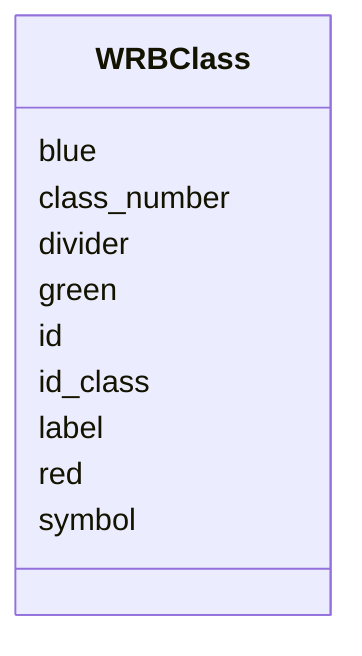

# Class: WRBClass 


_World Reference Base (WRB) soil classification with RGB color codes_

_for visualization and mapping purposes._


URI: [hwsd2:WRBClass](https://w3id.org/bioepic-data/fao-soils/hwsd2/WRBClass)





<!-- no inheritance hierarchy -->


## Slots

| Name | Cardinality and Range | Description | Inheritance |
| ---  | --- | --- | --- |
| [id](id.md) | 1 <br/> [Integer](Integer.md) | Database internal ID | direct |
| [id_class](id_class.md) | 0..1 <br/> [Integer](Integer.md) | Class identifier | direct |
| [class_number](class_number.md) | 0..1 <br/> [Integer](Integer.md) | Class number | direct |
| [divider](divider.md) | 0..1 <br/> [Integer](Integer.md) | Divider value | direct |
| [label](label.md) | 0..1 <br/> [String](String.md) | Full label for WRB class | direct |
| [symbol](symbol.md) | 0..1 <br/> [String](String.md) | Symbol code for WRB class | direct |
| [red](red.md) | 0..1 <br/> [Integer](Integer.md) | Red RGB color component (0-255) | direct |
| [green](green.md) | 0..1 <br/> [Integer](Integer.md) | Green RGB color component (0-255) | direct |
| [blue](blue.md) | 0..1 <br/> [Integer](Integer.md) | Blue RGB color component (0-255) | direct |


## Identifier and Mapping Information


### Schema Source


* from schema: https://w3id.org/bioepic-data/fao-soils/hwsd2


## Mappings

| Mapping Type | Mapped Value |
| ---  | ---  |
| self | hwsd2:WRBClass |
| native | hwsd2:WRBClass |


## LinkML Source

<!-- TODO: investigate https://stackoverflow.com/questions/37606292/how-to-create-tabbed-code-blocks-in-mkdocs-or-sphinx -->

### Direct

<details>
```yaml
name: WRBClass
description: 'World Reference Base (WRB) soil classification with RGB color codes

  for visualization and mapping purposes.'
from_schema: https://w3id.org/bioepic-data/fao-soils/hwsd2
slots:
- id
- id_class
- class_number
- divider
- label
- symbol
- red
- green
- blue
class_uri: hwsd2:WRBClass

```
</details>

### Induced

<details>
```yaml
name: WRBClass
description: 'World Reference Base (WRB) soil classification with RGB color codes

  for visualization and mapping purposes.'
from_schema: https://w3id.org/bioepic-data/fao-soils/hwsd2
attributes:
  id:
    name: id
    description: Database internal ID
    from_schema: https://w3id.org/bioepic-data/fao-soils/hwsd2
    rank: 1000
    identifier: true
    alias: id
    owner: WRBClass
    domain_of:
    - SoilMappingUnit
    - SoilLayer
    - WRBClass
    range: integer
    required: true
  id_class:
    name: id_class
    description: Class identifier
    from_schema: https://w3id.org/bioepic-data/fao-soils/hwsd2
    rank: 1000
    alias: id_class
    owner: WRBClass
    domain_of:
    - WRBClass
    range: integer
  class_number:
    name: class_number
    description: Class number
    from_schema: https://w3id.org/bioepic-data/fao-soils/hwsd2
    rank: 1000
    alias: class_number
    owner: WRBClass
    domain_of:
    - WRBClass
    range: integer
  divider:
    name: divider
    description: Divider value
    from_schema: https://w3id.org/bioepic-data/fao-soils/hwsd2
    rank: 1000
    alias: divider
    owner: WRBClass
    domain_of:
    - WRBClass
    range: integer
  label:
    name: label
    description: Full label for WRB class
    from_schema: https://w3id.org/bioepic-data/fao-soils/hwsd2
    rank: 1000
    alias: label
    owner: WRBClass
    domain_of:
    - WRBClass
    range: string
  symbol:
    name: symbol
    description: Symbol code for WRB class
    from_schema: https://w3id.org/bioepic-data/fao-soils/hwsd2
    rank: 1000
    alias: symbol
    owner: WRBClass
    domain_of:
    - WRBClass
    range: string
  red:
    name: red
    description: Red RGB color component (0-255)
    from_schema: https://w3id.org/bioepic-data/fao-soils/hwsd2
    rank: 1000
    alias: red
    owner: WRBClass
    domain_of:
    - WRBClass
    range: integer
    minimum_value: 0
    maximum_value: 255
  green:
    name: green
    description: Green RGB color component (0-255)
    from_schema: https://w3id.org/bioepic-data/fao-soils/hwsd2
    rank: 1000
    alias: green
    owner: WRBClass
    domain_of:
    - WRBClass
    range: integer
    minimum_value: 0
    maximum_value: 255
  blue:
    name: blue
    description: Blue RGB color component (0-255)
    from_schema: https://w3id.org/bioepic-data/fao-soils/hwsd2
    rank: 1000
    alias: blue
    owner: WRBClass
    domain_of:
    - WRBClass
    range: integer
    minimum_value: 0
    maximum_value: 255
class_uri: hwsd2:WRBClass

```
</details>